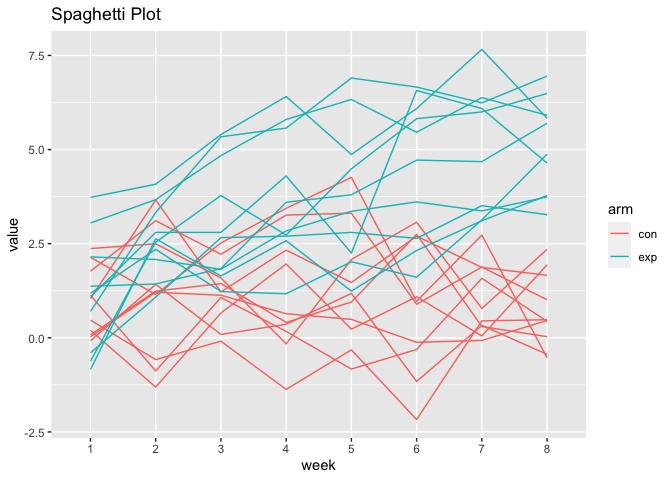
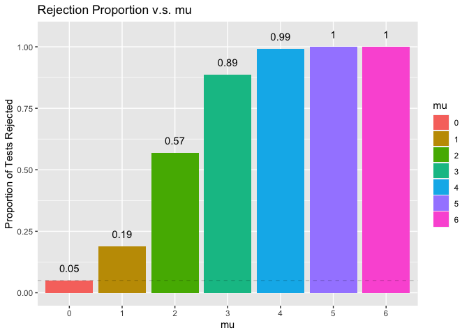
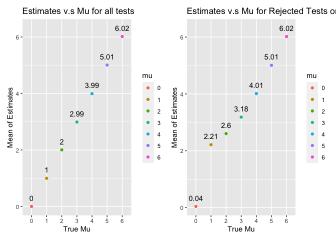

P8105 HW5
================
Wenbo Fei
11/18/2020

\#Problem 1 Read in the data.

``` r
homicide_df = 
  read_csv("data/homicide-data.csv") %>% 
  mutate(
    city_state = str_c(city, state, sep = "_"),
    resolved = case_when(
      disposition == "Closed without arrest" ~ "unsolved",
      disposition == "Open/No arrest"        ~ "unsolved",
      disposition == "Closed by arrest"      ~ "solved",
    )
  ) %>% 
  select(city_state, resolved) %>% 
  filter(city_state != "Tulsa_AL")
```

``` r
aggregate_df = 
  homicide_df %>% 
  group_by(city_state) %>% 
  summarize(
    hom_total = n(),
    hom_unsolved = sum(resolved == "unsolved")
  )
```

    ## `summarise()` ungrouping output (override with `.groups` argument)

Prop test

``` r
prop.test(
  aggregate_df %>% filter(city_state == "Baltimore_MD") %>% pull(hom_unsolved), 
  aggregate_df %>% filter(city_state == "Baltimore_MD") %>% pull(hom_total)) %>% 
  broom::tidy()
```

    ## # A tibble: 1 x 8
    ##   estimate statistic  p.value parameter conf.low conf.high method    alternative
    ##      <dbl>     <dbl>    <dbl>     <int>    <dbl>     <dbl> <chr>     <chr>      
    ## 1    0.646      239. 6.46e-54         1    0.628     0.663 1-sample… two.sided

Try to iterate

``` r
results_df = 
  aggregate_df %>% 
  mutate(
    prop_tests = map2(.x = hom_unsolved, .y = hom_total, ~prop.test(x = .x, n = .y)),
    tidy_tests = map(.x = prop_tests, ~broom::tidy(.x))
  ) %>% 
  select(-prop_tests) %>% 
  unnest(tidy_tests) %>% 
  select(city_state, estimate, conf.low, conf.high)
```

plot the results

``` r
results_df %>% 
  mutate(city_state = fct_reorder(city_state, estimate)) %>% 
  ggplot(aes(x = city_state, y = estimate)) +
  geom_point() + 
  geom_errorbar(aes(ymin = conf.low, ymax = conf.high)) + 
  theme(axis.text.x = element_text(angle = 90, vjust = 0.5, hjust = 1))
```

<!-- -->

# Problem 2

Read and Clean the data

``` r
files = list.files("data/data_2", pattern = "*.csv") # get the file name
# View(files)

data = files %>%                             
  map(~ read_csv(file.path("data/data_2", .)))  %>%  
  reduce(rbind)        # read data                       
# View(data)

# getting the arm and id 
participant = separate(data.frame(files), col=files, sep = "([._])", into =c("arm", "id")) 
```

    ## Warning: Expected 2 pieces. Additional pieces discarded in 20 rows [1, 2, 3, 4,
    ## 5, 6, 7, 8, 9, 10, 11, 12, 13, 14, 15, 16, 17, 18, 19, 20].

``` r
participants_df = tibble(participant, data ) %>% 
  pivot_longer(                                  
    cols = week_1:week_8,
    names_prefix = "week_",
    names_to = "week",
    values_to = "value"
  )
# View(participants_df) 
```

Spagetti Plot: each line represents a participant

``` r
participants_df %>%
  mutate(
    unique = str_c(arm , id, sep="_") 
  ) %>%
  ggplot( aes(x = week, y = value, group = unique)) + 
  geom_line(aes(color=arm)) + 
  labs(
    title = "Spaghetti Plot"
  )
```

<!-- -->

Control groups always stays in a relatively low value with no obvious
increasing or decreasing trend, while experiment group starts with
similar values to control group but has obvious overall increasing
trend.

# Problem 3

``` r
alpha = 0.05 

sim_est = function(mu = 0, n = 30, sigma = 5, mu_0 = 0) {
  sim_data = tibble(                    
    x = rnorm(n, mean = mu, sd = sigma), # simulate data
  )
 
  t.test(sim_data, mu = mu_0) %>% # t test
    broom::tidy() %>%          # clean output to a tibble
    select(estimate, p.value)  # get the estimate and the p-value 
}
```

Generating 5000 datasets and repeat for all mu values.

``` r
set.seed(1) 
sim_results = 
  tibble(mu = c(0:6)) %>%  
  mutate(                  
    output_lists = map(.x = mu, ~rerun(5000, sim_est(mu = .x))), 
    estimate_df = map(output_lists, bind_rows)) %>% 
  select(-output_lists) %>% 
  unnest(estimate_df)

# View(sim_results)
```

Make a plot showing the proportion of times the null was rejected (the
power of the test) on the y axis and the true value of mu on the x axis.
Describe the association between effect size and power.

``` r
sim_results %>% 
  mutate( 
    mu = as.factor(mu),
    reject_status = ifelse(p.value > alpha, 0, 1) 
  ) %>% 
  group_by(mu) %>% 
  summarize( 
    prop = mean(reject_status)) %>% # calculate proportion
  ggplot(aes(x = mu, y = prop)) + 
  geom_col(aes(fill=mu)) +
  geom_hline(yintercept=0.05, linetype="dashed", size=0.1) +
  geom_text(aes(label=round(prop, 2), y = prop + 0.05)) + 
  labs(
    title = "Rejection Proportion v.s. mu",
    y = "Proportion of Tests Rejected"
  )
```

    ## `summarise()` ungrouping output (override with `.groups` argument)

<!-- -->

Only if mu=0, will the proportion of rejected test is close to 0.05,
this is consistent with our null hypothesis that mu\_0=0.

Plot of estimated mu v.s true mu

``` r
mean_values = sim_results %>% 
  mutate(
    mu = as.factor(mu),
  ) %>% 
  group_by(mu) %>% 
  summarize(mean_est = mean(estimate)) %>% 
  ggplot(aes(x = mu, y = mean_est)) + 
  geom_point(aes(color=mu)) +
  geom_text(aes(label=round(mean_est, 2), y = mean_est+0.3)) + 
  labs(
    title = "Estimates v.s Mu for all tests",
    y = "Mean of Estimates",
    x = "True Mu"
  ) 
```

    ## `summarise()` ungrouping output (override with `.groups` argument)

``` r
rejected_means = sim_results %>% 
  mutate(
    mu = as.factor(mu)) %>% 
  filter(p.value <= alpha) %>%
  group_by(mu) %>% 
  summarize(mean_est = mean(estimate)) %>% 
  ggplot(aes(x = mu, y = mean_est)) + 
  geom_point(aes(color=mu)) +
  geom_text(aes(label=round(mean_est, 2), y = mean_est+0.3)) + 
  labs(
    title = "Estimates v.s Mu for Rejected Tests only",
    y = "Mean of Estimates",
    x = "True Mu"
  ) 
```

    ## `summarise()` ungrouping output (override with `.groups` argument)

``` r
# plotting them together 
mean_values + rejected_means
```

<!-- -->

When \(\mu=0\), the sample average of \(\hat \mu\) across tests for
which the null is rejected is approximately equal to the true value of
\(\mu\), because the null hypothesis is true and those rejected samples
can been seen still as random samples from the true distribution thus
the mean of estimates are still 0.

When \(\mu=1, 2 (or even 3)\), the sample average of \(\hat \mu\) across
tests for which the null is rejected is not approximately equal to the
true value of \(\mu\), because the null hypothesis is false, and those
samples we rejected are biased towards a larger estimate, so the mean of
estimates is also larger than the true mu.

When \(\mu=5, 6\), the sample average of \(\hat \mu\) across tests for
which the null is rejected is again approximately equal to the true
value of \(\mu\), because as the true mu is far from the null, so almost
all the samples will be rejected, thus the rejected samples again can be
seen as random samples from the true distribution thus the mean of
estimates are close to true.
